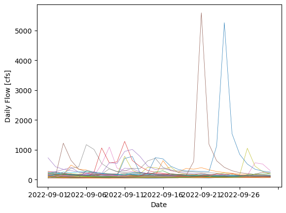

Dave Drainer  
10 Sep 2023  
Homework Assignment 3  

##
## Grade
3/3 Great job!
- Next time try using some markdown formatting instead of html formatting. You can refer to the markdown cheet sheet in the course folder for some examples. You can also see the markdown formatting edites I made to your submission below. 
- Love the use of a while loop to make the graph! Really great. 
##

### Assignment Question Answers

1. The variables flow, year, month, and day are lists. Flow is a list of the daily average streamflow discharge in cfs for the Verde River station from Jan 1, 1989 to Sep 7, 2023. The flow list contains all floats while the year, month, and day lists all contain ints. All four lists are the same length at 12668 items.
   
2. My previous prediction for the only date in Sep this far was 48 cfs valid for 9 Sep. Since Jan 1, 1989 the streamflow was greater than this 12,112 times, which amounts to a percentage of approximately 95.6% of the time (so, I would call anytime the streamflow is less than 48 cfs an anomaly). This also means I'm terrible at streamflow forecasting.
   
3. For daily flows in 2000 or before, the streamflow was greater than my previous forecast a total of 4,331 times, which is approximately 98.8% of the time during that time period. Since 2010, this has occurred 4,630 times, which is approximately 92.6% of the time.

4. I used matplotlib to make a graph inside a while loop for every year of the day for the month of Sep. This graph shows that in Sep, the flow is overall slightly higher in the first half of Sep and then becomes lower in the second half. Flow is mostly below 500 cfs for the first half, with a few days that peak over 1000 cfs. During the second half of the month, there were only two to four ocurrences of higher flow, but these were much higher, topping 5000 cfs.

### Summary of Forecast 

For this week's forecast, I originally averaged all of the streamflow for the month of Sep going back to 1989. That didn't seem to be very representative, so I averaged the streamflow since Aug 1, 2023. Considering it's looking really dry over the next 6-10 days, with the exception of some rain expected in the next couple of days, we'll go with the lower end of the range of streamflow values. The mean since Aug 1 was about 88 cfs, with a max of 157 cfs and min of 49 cfs. So for the next two weeks I'll estimate 65 and 55 for week 1 and 2, respectively. I'll go with a little bit higher for week 1 with the rainfall expected over the next couple of days.