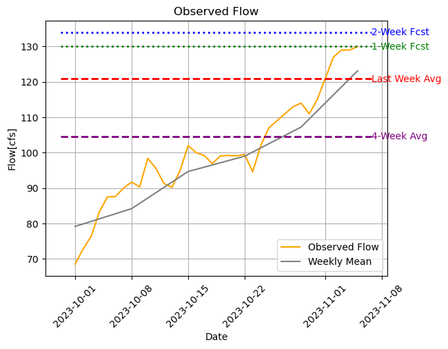

## Dave Drainer
## HWRS 501
## 6 Nov 2023, Homework 10

### Grade
3/3: Great job! Nice find on the 'f-string' option that was one I hadn't used before. Functions, loops and implicit looping can be very confusing and we'll try to keep practicing with them throughout the rest of class too. 

1. My completed exercises are in the week10_exercises.py script.
   
2. (1). What I learned: I keep building on my knowledge about how to access specific parts of dataframes and arrays, so the practice with that is really helping. I usually end up with a dataframe that is not what I expected at first, so I try and run the code line by line to see what I'm missing or where I went wrong. The fill function for graphs is really neat, and after some much needed help I understand it much better. In trying to complete the final exercise, I found something called an "f-string" from doing some searching and it seems to be pretty helpful when trying to filter things. It's not super intuitive, but seems to be somewhat of a shortcut. I'll make sure to keep practicing with that and other ways to filter data.
   
   (2). What I still find confusing: I don't think it's a problem with understanding, it's just remembering how to do things once I learn it. The most confusing thing still to me are probably loops with embedded loops or functions...like when you're trying to loop over a particular row or column of data, compute something and store it in a new array. I just get lost pretty easily so it usually takes me quite a while to break it down piece by piece. One minor thing--I really like the linter to help with the formatting, but some of the indentation corrections are difficult to understand. That's a pretty minor thing, though.

3. Forecast submitted: Week 1 Forecast - 130 cfs, Week 2 Forecast - 134 cfs. I followed the same forecast process as the last couple of weeks, just trying to follow the historical trend and make adjustments based on current observed flow data.

