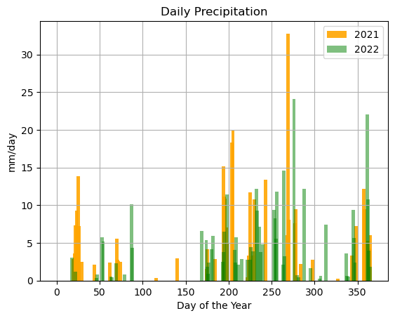

### Dave Drainer
### HWRS 501
### 20 Nov 2023, Homework 12

1. Forecast Summary: I cleaned up my forecast script a little bit and got rid of some unnecessary things. I used two different APIs to grab out some precipitation data to try and determine a correlation between that and streamflow. For this past year, accumulated precipiation hasn't really increased a lot in the fall, yet streamflow continues to increase. Then I plotted precipiation data for the previous couple of years ad compared it with the monthly and weekly average streamflow and there's definitely at least some relationship between precipitation and streamflow at Camp Verde. So, I decided to continue to increase my streamflow for my forecast for the next couple of weeks, making some tweaks based on recent observed flow and the mean flow over the past month and past week. 
   
2. There are 3 datasets I used, but all of them are precipitation data. For the two datasets from Daymet, I just used the web API builder to build the entire URL, and then accessed it that way. For the second year that I pulled data, I just changed the dates in the URL reather than going through the request again.
   
   1. Precipitation Accumulation for 2023
      - Location: QVDA3 for Camp Verde from https://api.synopticdata.com/v2/stations/timeseries

   2. Daily Precipitation for 2021
      - Location: Lat/Lon Input (34.56368003515758, -111.86310056727073) for Daily Precip from https://daymet.ornl.gov/single-pixel/api#
  
   3. Daily Precipitation for 2022
      - Location: Lat/Lon Input (34.56368003515758, -111.86310056727073) for Daily Precip from https://daymet.ornl.gov/single-pixel/api#
  
3. Plots of my timeseries:
   1. Precip accumulation:
      - 

   2. Daily Precip from Daymet (both datasets):
      - 

   3. Observed Flow and Forecast
      - 

4. The APIs seem to be complicated, but also not complicated--maybe painfully tedious is a better way to describe it. I am having trouble creating datetime objects for timeseries when the data isn't in a perfect format already, like it seemed to be for the USGS streamflow data for Camp Verde. I haven't been successful creating it when I just have something like a day of the year. Can you create Julian dates and make it work that way? Also, how do I overlay different plots with different scales of data on the same axes (like streamflow and precipiation, when one is in mm and the other in cfs)? Pulling data from APIs is a great tool, and this is really enjoyable. I think my trouble is just figuring out how to manipulate the data when everything is in so many different formats. I also tried to use the linear regression to help make a forecast, but that was a bust and I abandoned it. It would be cool to learn some more statistical analysis and prediction tools, but seems to be more complicated that I thought--especially when using datetime objects.

