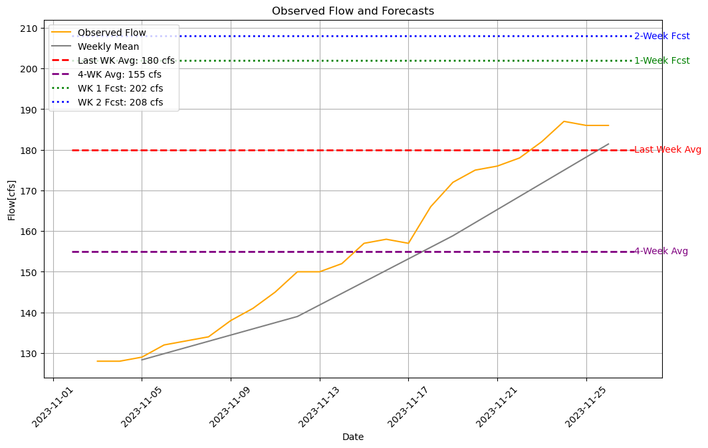

### Dave Drainer
### HWRS 501
### 27 Nov 2023, Homework 13

### Grade
9/9 
Nice work! Your code is much improved and easier to follow this time around. 
Glad that you find using Copilot to be useful. It definitely takes practice to figure out the best way to incorporate it but when you get the hang of it it has a lot to offer. 

Also very glad to see your use of datetime. It makes your code easier to follow. 

I provided a few comments throughout your code just for future reference. One general comment is to avoid defining variables and then giving them a different name later on this can make your code harder to follow. 

1. Forecast Summary: I'm still calculating my forecasts based on the difference between the weekly average and monthly average and adding it to the most recent observed flow. This week, I updated the percentages I used in my forecast based on the fact that I have been consistently low over the past few weeks. My week 1 forecast for 2023-12-04 is  202 cfs and my week 2 forecast for 2023-12-11 is  208 cfs.

2. Reflections: I really like the Copilot tool in VS code. It helps to quickly fix or format something, and I used it to help with a label that is written based on a variable input--the label text will use a variable input, such as a date, when it's printed. I also figured out how to use datetime to calculate differences between dates using timedelta. Those were the two new functions I created--one to add days to a date, another to subtract days from a date. This was handy when trying to change my code for a single forecast date variable input. There were a lot of lines of code that I removed because I realized I didn't need them. What is left is a simply plot to show a trend and a forecast based on that trend. I think my code could be improved by still using more variables or 'for' loops to help repeat things.
   
3. ChatGPT: The main thing I used chat GPT for this time was helping come up with a way to do quick date calculations for the forecast dates using the datetime module. I think what I did works pretty well, and it's simple, but I'm sure it could be streamlined or more generalized somehow.