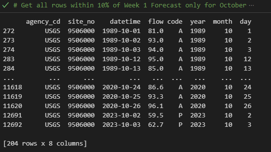

## Dave Drainer
## HWRS 501
## 5 Oct 2023, Homework 6

### Grade
3/3 - Great job!
###

### Forecast Summary

* Looking at upstream forecasts for Sedona (KSEZ) and Flagstaff (KFLG), which look to be in higher elevation, there is only a very slight chance of rain over the next week. I averaged the last 5 years of data for the first half and second half of October separately. This year, the average flow in the first half of Oct so far is the lowest it has been in the period of record. Since there looks to be a little bit of correlation between the flow at Camp Verde and rainfall at KSEZ and KFLG, based on observations from a light rain event in mid-September, I'm going to try and use this as the basis for my streamflow forecast--at least for week1. For week 2, I'm going to go closer to the average for the second half of Oct.

### Homework Exercise Answers

1. The column names are 'agency_cd', 'site_no', 'datetime', 'flow', 'code', 'year', 'month', 'day'. The index is the default numeric index starting at 0 and ending at 12693. Using data.info(), we find there are different data types depending on the column; year, month and day are int32, agency_cd, datetime, and code are all objects, and site_no is an int64 while flow is a float64.
2. Summary of the flow column: min = 19, mean = 353, max = 63400, standard deviation = 1463 and quartiles: 25% = 93, 50% = 157, 75% = 215.
3. Summary of monthly flow with statistics: 

| Month |  Count  | Mean  |   Std |    Min |   25% | 50%   | 75%   |
| ----- | ----- | ----- | -----  | ------ | ----- | ----- | ----- |                                                             
|1 | 1084.0 |  694.385609 | 2642.701653 | 158.0 | 202.000 | 220.0  | 314.00 |  
|2 |      988.0 |  877.008097 | 3208.739869 | 136.0 | 199.000 | 238.0 |  612.50  | 
|3  |    1085.0 | 1064.491244 | 2416.095415 |  97.0 | 180.000 | 378.0 | 1070.00  | 
|4 |     1050.0 |  323.222857 |  584.313196 |  64.9 | 111.000 | 141.0 |  218.75  | 
|5 |     1085.0 |  103.845991 |   49.928918 |  39.9 |  76.600 |  92.0 | 118.00   |
|6 |     1050.0 |   65.066762  |  28.191344 |  22.1 |  48.325 |  60.0 |   76.00  | 
|7 |     1085.0 | 105.943871 |  214.174556  | 19.0 |  52.000 |  70.0  | 110.00   |
|8 |     1085.0 |  170.843687 |  288.914361 |  29.6 |  78.000 | 116.0 |  178.00  | 
|9  |    1050.0 |  166.601810 |  274.594973 |  37.5 |  86.150|  117.0 |  166.00   |
|10 |    1057.0 |  145.145412  | 111.111617 |  55.7 | 106.000 | 126.0  | 153.00  | 
|11 |    1020.0 |  199.985294 |  225.677357 | 117.0 | 153.000 | 171.5 |  197.00  | 
|12 |    1054.0 |  330.376660 | 1052.000260 | 153.0 | 189.000 | 203.0 |  225.00 |

4. The 5 lowest flows are: 

   
   The 5 highest flows are: 

5. I looked for the flow that was within my week 1 forecast of 80 cfs for only the month of October, because of all the months there were too much data. I filtered for within 10%, 5%, and 1%, and here are the screenshots of that data: 

