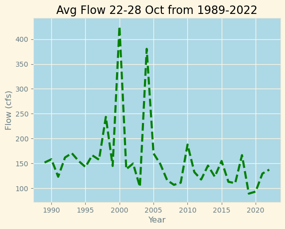
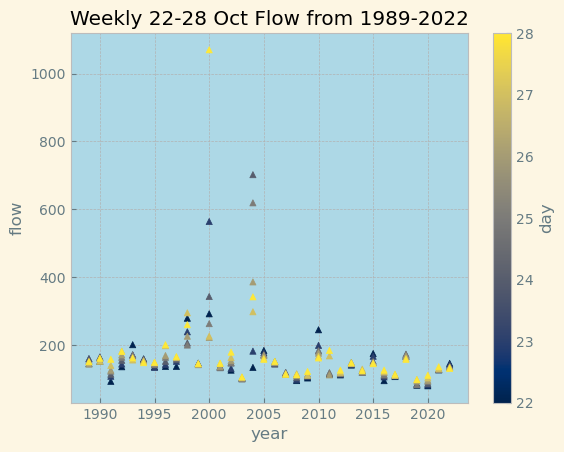
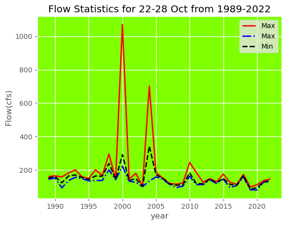
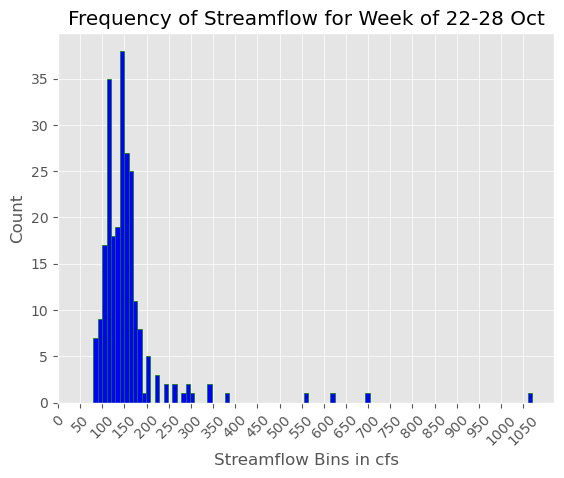
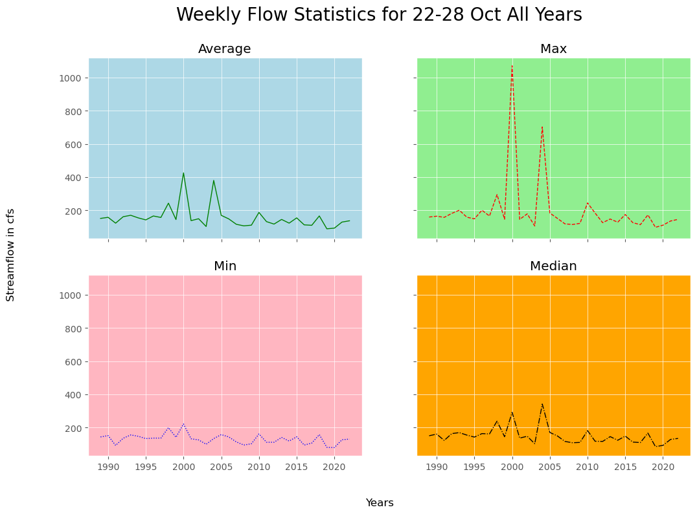

## Dave Drainer
## HWRS 501
## 16 Oct 2023, Homework 7

1. Forecast Summary: This week I tried to use some additional kind of statistical analysis to help come up with a forecast, but it din't really work out too well, and didn't give me any more insight to the flow other than just looking at the most recent data and making a guess, then determining the likelihood of such a flow by comparing stats of the week of 22-28 Oct from all years available. I'll stick with flows in the 70-75 cfs range, since there seems to be no rain in the forecast for the foreseeable future.
2. 5 plots that summarize the streamflow data:
   1. Plot 1: Line Plot of Average Flow during the week of 22-28 Oct for all years available
   2. Plot 2: Scatter Plot of All Flow during the weeek of 22-28 Oct for all years available
   3. Plot 3: Multiple Line Plot of Flow Statistics for week of 22-28 Oct for all years available
   4. Plot 4: Histogram for Frequency of Streamflow fro week of 22-28 Oct for all years available
   5. Plot 5: Subplots of Max, Min, Mean, and Median Streamflow for week of 22-28 Oct
3. Images of 5 plots:
   1. 
   2. 
   3. 
   4. 
   5. 
4. Reflection on Progress: This week started out simple enough, but there are so many ways to work with matplotlib that after a couple of days, I had a bunch of problems and was getting frustrated with errors. The biggest problem I had was with using the groupby function in pandas to aggregate things and then take a mean, and try to plot the results. I kept getting a  KeyError: 'year' message, like the year column of my data didn't exist. After some searching, it looked like because I used the groupby function, it was resetting the index and that's what was creating problems with plotting. I never did get a bar graph to work... and this was the main problem with that. Simple line plots are very easy, and scatter plots seem easy enough. I'm still confused on the bins with histograms, especially when there is a log involved, and bar graphs seem simple but not when using a pandas dataframe for some reaon. I'm feeling more confident with plotting, but with the wide array of options still seems overwhelming. Plotting graphs are definitely exciting, and I'm eager to learn how to make them more usable.
