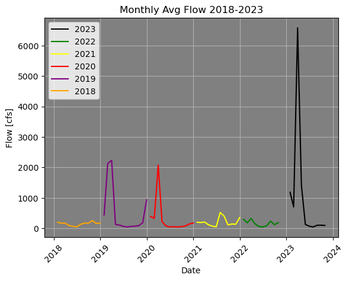
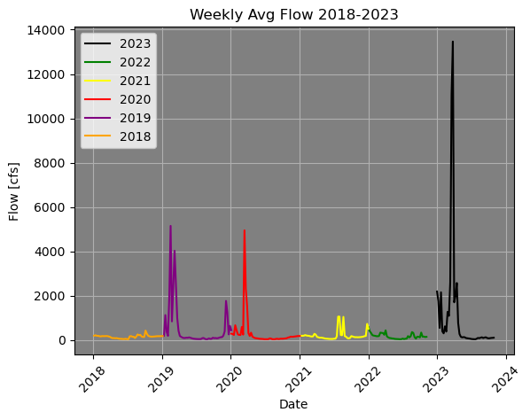
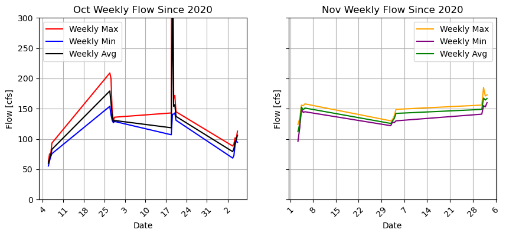
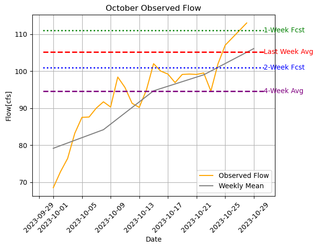

## Dave Drainer
## HWRS 501
## 30 Oct 2023, Homework 9

### Grade 8.5/9
**Code Review**
- I left comments in your code with some suggestions they all start with #LC 
Readability: 2.75/3 
    - Overall easy to read however it was not clear why all of the parts of your code were needed to generate your forecast. Some additional commenting throughout to explain the purpose of each block of code and why you are testing each thing would be helpful (I took of 0.25 for comments) 
    - Good job with your variable names they were very clear. 
    - Nice work adding doc strings! I showed you how to move them inside your functions for future reference. 
Style: 3/3
    - Very good. 
Code:  2.75/3
    - Nice work your code ran perfectly for me!
    - I made some suggestions for how you could streamline by combining your three functions and creating an additional function lower down. 
    - The hardest part was just not knowing how all the pieces fit together and why you were doing different steps. 

1. Forecast Summary: I basically looked at the mean flow over the past several weeks and then tried to match it with the history of streamflow in the month of November from the past few years. I adjusted percentages based on what looked to fit the overall trend and history in the graphs that I plotted. I came up with 111 cfs for the 1-week forecast, and 101 cfs for the 2-week forecast, as it looks like Nov flow is pretty consistent, with a slight drop after the first part of the month.
2. Improvements to Script: I cut out a few lines of code and really used the linter to clean up the formatting. I was also more specific with some of the comments to make it easier to read. I also improved the historical plots and assigned each color a year to make it easier to distinguish the trend.
3. Description of Function(s): I created 3 functions to calculate min, max, and mean of a particular column of a dataframe. This made the code much easier to write and understand. Instead of attaching the mean/max/min methods to the end of resampling, I just put that part in the function and then created generic variables for the dataframe, column of interest, and period of sampling. I was able to cut out some of the code by doing this.
4. I had some trouble with the dates in the last plot that shows my forecast compared with the monthly average originally, and had to go back and grab my oringinal code. I ran into a little bit of trouble with the function(or so I think) as it returned a dataframe with the index being datetime, but the also included the site_no column along with the flow. I'm not sure why I got both of those columns, as I thought I should have just got the datetime index and flow column.

***
### These are my plots:
1. 
2. 
3. 
4. 