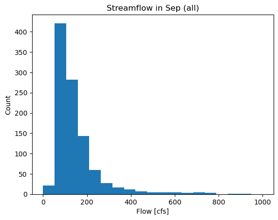
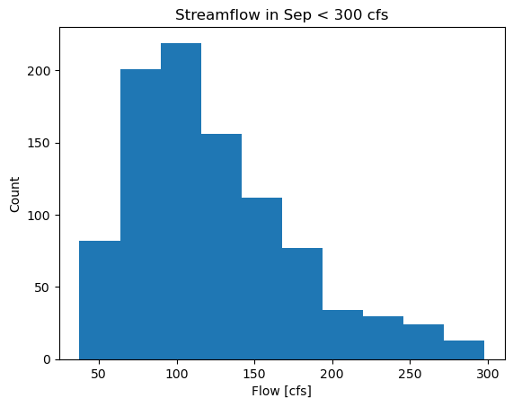

Dave Drainer  
17 Sep 2023  
Homework Assignment 4  

<h3> Assignment Question Answers  

<h4>

1. I calculated the mean flow for all of Sep to get an idea of what the average streamflow is for that month, which resulted in approx 123 cfs. I then broke out the most frequent values of all of the streamflow, which appeared to be less than 300 cfs for all months. Looking at just the data for the month of Sep, I calculated the max, min and median values for the subset of flow that is less than 300 cfs for the month of Sep. These values lined up with the trends of most recent observed streamflow, so I picked some values that were a happy medium for the next couple of weeks. Flow seems to fluctuate between 50-80 cfs and 110-130 cfs regardless of the presence of rainfall near Campe Verde.  

   
2. The variable flow_data is a 2-D numpy array containing 12,677 rows in 4 columns. The data are 64-bit floating point numbers.

3. My previous Sep forecast from last week was 65 cfs. Looking through the data, the actual streamflow has been greater than this 11,174 times, or about 88% of the time. I would say then that it would be an anomaly for my forecast to be correct. It has been greater than my current forecast of 123 cfs a  total of 7,885 times, or about 62% of the time--not so anomalous. If we just look at the month of Sep for my most recent forecast, this occurred 473 out of 1036 times, or about 46%.
   
4. If we consider only the flows before the year 2000 in the month of Sep for my most recent Sep forecast, it has only been observed 247 times, which is about 35% of the time. Since 2010 these numbers are 155 times for about 38% of the time. This means that when you considere more recent data only, the flow is greater than my forecast more often.

5. Using simple mean and median calculations on the first and second half of the month of Sep, there is a mean from Sep 1-15 of about 173 cfs with a median of 127 cfs. In the second half of the month from 16-30 Sep the mean was 163 cfs and median 108 cfs. This leads me to believe that there is higher overall streamflow in the first part of Sep, which makes sense if you consider a more active Southwest Monsoon flow in the first half of the month.
   
6. The question that didn't really make sense to me is #3. I couldn't really understand if it's asking me to compare my previous forecast for Sep or most recent forecast (this week) to either data from all years in just the month of Sep, or data from all years in all months. Aside from that, the biggest problem I have is trying to keep rows and columns straight in my head when performing operations on arrays. It's also difficult to combine different things at once and it's easy to get lost when doing so.

<h2> Summary of Forecast  

<h4> For this week's forecast, I looked at the total number of occurrences of specific streamflow. It appears that most often, streamflow in Septemeber is at or below 300 cfs. I then isolated the flow to show a histogram of everything less that 300 cfs. From that data, most often the flow is around 100-110 cfs. Based on the most recen obseved streamflow of 111 cfs and the trend of flow as low as 58 cfs and as high as 157 cfs, I'm going to go with a forecast of the mean streamflow for Sep, which is 123 cfs for week 1. To go a little lower, I'll go with a flow of 85 for week 2, as that's still within a range of most frequent streamflow values in Sep, between the 2nd and 3rd quartiles.