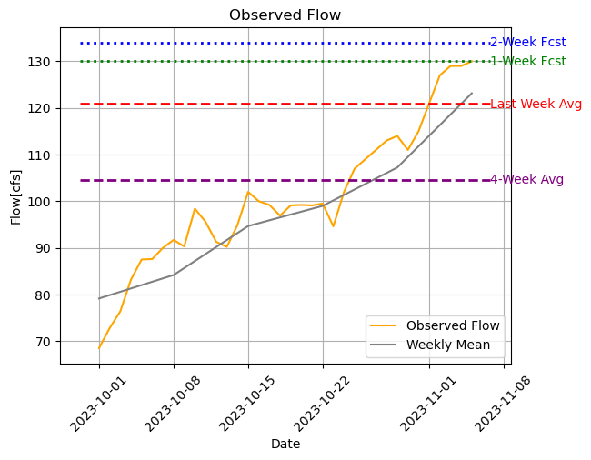

## Dave Drainer
## HWRS 501
## 6 Nov 2023, Homework 10

1. My completed exercises are in the week10_exercises.py script.
   
2. (1). What I learned: I keep building on my knowledge about how to access specific parts of dataframes and arrays, so the practice with that is really helping. I usually end up with a dataframe that is not what I expected at first, so I try and run the code line by line to see what I'm missing or where I went wrong. The fill function for graphs is really neat, and after some much needed help I understand it much better. In trying to complete the final exercise, I found something called an "f-string" from doing some searching and it seems to be pretty helpful when trying to filter things. It's not super intuitive, but seems to be somewhat of a shortcut. I'll make sure to keep practicing with that and other ways to filter data.
   
   (2). What I still find confusing: I don't think it's a problem with understanding, it's just remembering how to do things once I learn it. The most confusing thing still to me are probably loops with embedded loops or functions...like when you're trying to loop over a particular row or column of data, compute something and store it in a new array. I just get lost pretty easily so it usually takes me quite a while to break it down piece by piece. One minor thing--I really like the linter to help with the formatting, but some of the indentation corrections are difficult to understand. That's a pretty minor thing, though.

3. Forecast submitted: Week 1 Forecast - 130 cfs, Week 2 Forecast - 134 cfs. I followed the same forecast process as the last couple of weeks, just trying to follow the historical trend and make adjustments based on current observed flow data.

