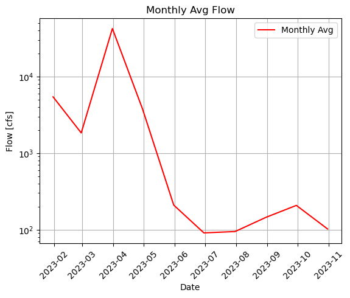
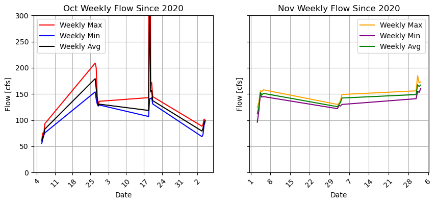
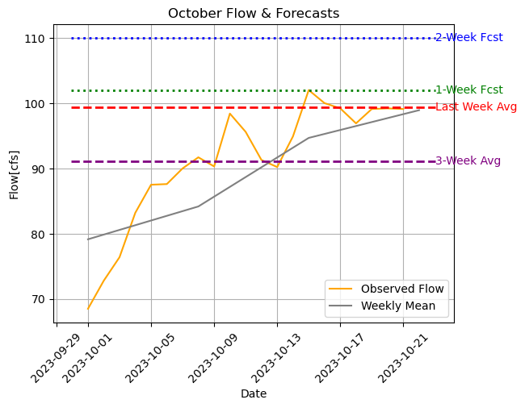

##### Dave Drainer
##### HWRS 501
##### 23 Oct 2023, Homework 8

1. Forecast Summary: This week I tried using a bunch of different averages to see what made sense based on the most recent flow. I incorporated the average flow for the past week into my calculation for the 1-week forecast of 102 cfs, which follows the most recent trend of weekly averages for the month of October. I then incorporated the 3-week average for the rest of the month with the average flow in Nov, since we're getting close to the new month. After tweaking with percentages to make it closer to the upward trend, I came up with a 2-week forecast of 110 cfs.
2. Plot Images:
   - This is a plot of the monthly averages of 2023 to get an idea of the overall trend. Shows the flow pretty much tanking toward the end of the year...so my forecasts should be close to current observed.
   
   - This is two subplots to show weekly averages coparison from Oct and Nov for a couple of recent years back to 2020, which shows a slight increase in flow over the next month.
   
   - This last graph is a close up view of the latest observed Oct flow, along with a trend line of the weekly averages. The last week's average and past 3-week average flows are plotted as horizontal lines to compare with my 1-week and 2-week forecasts, also horizontal lines. Generally showing an upward trend, so I tweaked my values to match.
   
3. The timeseries is actually really simple once you figure out the syntax. I like it a lot, and it has made slicing things much easier when setting the datetime index. I really don't understand why sometimes my dataframe seems to get reset where I have to tell python to make my new dataset a datafram again. I would think if I make a new dataset from a dataframe, it would automatically be a dataframe. But, that doesn't seem to be the case and I'm not sure why.